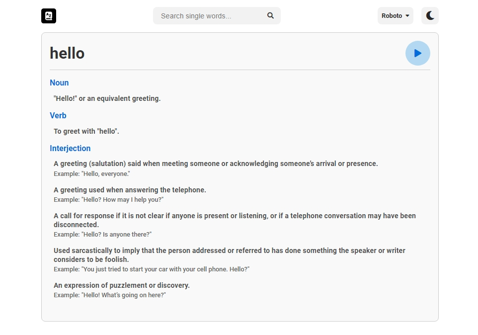
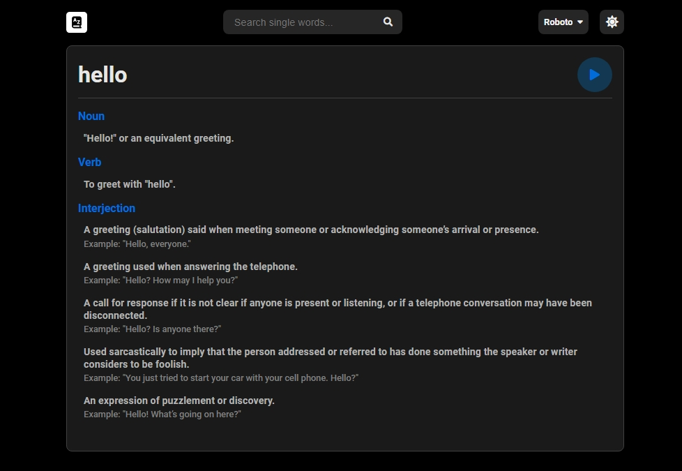

# Dictionary App

Live: [here](https://gp-dictionary-app.netlify.app)

A sleek and modern dictionary web application that allows users to search for words and get detailed information including definitions, phonetics, synonyms, antonyms, and example sentences. The application also features a dark mode toggle and font selection for enhanced user experience.

## Features

- **Word Search**: Search for any word and get detailed information.
- **Definitions**: Provides multiple definitions for different parts of speech.
- **Phonetics**: Displays the phonetic pronunciation of the word.
- **Synonyms and Antonyms**: Lists synonyms and antonyms if available.
- **Example Sentences**: Provides example sentences to understand word usage.
- **Audio Pronunciation**: Play and pause audio pronunciation of the word.
- **Dark Mode**: Toggle between light and dark themes.
- **Font Selection**: Choose from various fonts for better readability.
- **Responsive Design**: Works seamlessly on both desktop and mobile devices.

## Technologies Used

- **HTML**: For structuring the content on the web.
- **CSS**: For styling the application.
  - Flexbox: For layout structure.
  - Media Queries: For responsive design.
- **JavaScript**: For application logic and interactivity.
  - Fetch API: For making API requests.
  - Local Storage: For storing theme preferences.
- **Dictionary API**: [Free Dictionary API](https://dictionaryapi.dev/) for fetching word data.

## Getting Started

### Prerequisites

You need a modern web browser to run this application.

### Installation

1. Clone the repository:
    ```bash
    git clone https://github.com/gabriel-pipia/Dictionary-App.git
    ```

2. Navigate to the project directory:
    ```bash
    cd Dictionary-App
    ```

3. Open `index.html` in your favorite web browser.

## Usage

1. Use the search bar to look up any word.
2. Click the play button to hear the pronunciation (if available).
3. Toggle dark mode using the moon/sun button in the top-right corner.
4. Change the font from the dropdown menu next to the dark mode toggle.

## Project Structure

- `index.html`: Main HTML file.
- `styles.css`: CSS file for styling the application.
- `script.js`: JavaScript file for handling application logic.
- `README.md`: Project documentation.

## Screenshots




## License

This project is licensed under the MIT License. See the [LICENSE](LICENSE) file for details.

## Acknowledgements

- [Free Dictionary API](https://dictionaryapi.dev/)
- [Font Awesome](https://fontawesome.com/) for icons

## Author

Gabriel Pipia
- [GitHub](https://github.com/gabriel-pipia)

Feel free to contribute, open issues, or provide feedback!

---

Thank you for checking out this project!
